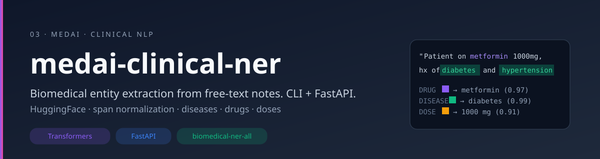
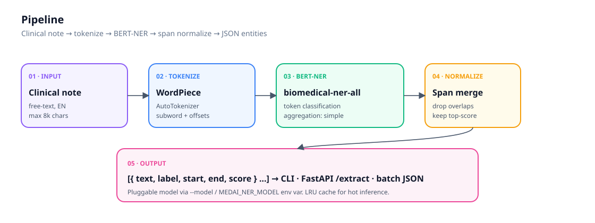

# medai-clinical-ner

A **biomedical Named Entity Recognition** service that turns free-text clinical notes into **structured entities** — diseases, drugs, doses, anatomy — via a Hugging Face pipeline, with span normalization and a FastAPI endpoint.

<p align="center">
  
</p>

<p align="center">
  
  
  
  
  
</p>

<p align="center">
  <a href="#why-it-exists">Why It Exists</a> &middot;
  <a href="#what-it-does">What It Does</a> &middot;
  <a href="#why-it-matters">Why It Matters</a> &middot;
  <a href="#quick-start">Quick Start</a>
</p>

---

## Why It Exists

Clinical notes are the **richest unstructured signal in healthcare** — and the hardest to use. A note that says *"Patient is a 64-year-old female with T2DM on metformin 1000mg"* hides four structured facts (age, sex, disease, drug, dose) inside a sentence no database can query.

Public NER demos exist, but they ship as **toy snippets**. There's no service to call, no span deduplication, no CLI for batch jobs, no caching. Researchers end up gluing together their own wrapper every time.

This repo is that wrapper, **done once and done cleanly** — so the next person can focus on the actual research instead of re-implementing token aggregation.

> Educational and research use only. Do not send real PHI to hosted models without proper de-identification and institutional approval.

## What It Does

<p align="center">
  
</p>

- **Loads** any HuggingFace token-classification model (default: `d4data/biomedical-ner-all`) — switchable via `--model` flag or `MEDAI_NER_MODEL` env var.
- **Tokenizes + classifies** with WordPiece + offsets, then uses the `simple` aggregation strategy to recover word-level spans.
- **Normalizes spans** — merges sub-tokens, drops overlapping detections, keeps the higher-confidence span. The bit most demos skip.
- **Serves three interfaces**:
  - **CLI** — `python -m src.ner --text "..."` for ad-hoc inspection
  - **FastAPI** — `POST /extract` for service integration, with LRU-cached models
  - **Batch** — `python -m src.batch --input-dir ...` for a folder of `.txt` notes
- **Returns clean JSON**: `[{text, label, start, end, score}, …]` ready for downstream joins.

## Why It Matters

Most clinical-AI research pipelines need NER as a **prerequisite, not the goal** — they want to know which drugs a patient is on so they can study DDI risk, or which diseases co-occur so they can study comorbidity patterns.

Shipping NER as a **clean, swappable service** means:

- You can plug `medai-clinical-ner` into a larger pipeline ([[ddi-risk-explorer]], cohort selection, EHR summarization) without re-deriving span logic.
- Switching backbones is a **one-line env-var change**, so you can compare `biomedical-ner-all` vs `Medical-NER` vs a domain-tuned model on your own notes.
- The output is **JSON spans with char offsets** — joinable against the original note, not lost in token-space.

The representation gap is biggest in **non-English clinical text** — the listed models are English-only, but the architecture here generalises. Swap in an Arabic-tuned backbone and the rest of the pipeline doesn't change.

## Quick Start

```bash
git clone https://github.com/kareemindata/medai-clinical-ner.git
cd medai-clinical-ner

python -m venv .venv && source .venv/bin/activate
pip install -r requirements.txt

# CLI (first call downloads ~500 MB to HF cache)
python -m src.ner --text "Patient is a 64-year-old female with T2DM on metformin 1000mg and lisinopril 20mg."

# API
uvicorn src.app:app --reload --port 8000
# POST http://localhost:8000/extract  body: {"text": "..."}

# Batch
python -m src.batch --input-dir data/notes --output out.json
```

## Project Structure

```
src/
  ner.py        # core extractor · span normalizer · CLI
  app.py        # FastAPI service · LRU pipeline cache
  batch.py      # folder-level batch runner
tests/
  test_ner.py   # span normalization (no model download required)
assets/
  banner.svg · architecture.svg
```

## Key Design Decisions

- **Span normalization is non-optional.** Models leak overlapping sub-token detections; we keep the highest-scoring span and discard the rest.
- **Pluggable backbone.** Models are decided by config, not code. Swap in a domain-tuned NER without touching the pipeline.
- **LRU-cached pipelines.** A FastAPI worker holding a 500 MB model in memory shouldn't reload it per request.
- **Char-level offsets out.** Downstream joins need `(start, end)` against the **original string**, not subword indices.

## Suggested Backbones

| model | notes |
| --- | --- |
| `d4data/biomedical-ner-all` | broad biomedical entity coverage (default) |
| `Clinical-AI-Apollo/Medical-NER` | clinical-note tuned |
| `blaze999/Medical-NER` | DeBERTa-based, strong on drugs / diseases |

## Caveats

- All listed backbones are **English-only**. Arabic / multilingual clinical NER needs domain-tuned models on top of multilingual encoders.
- **Entity schemas differ** between backbones — don't compare F1 across models without aligning label sets.

## Tech Stack

```
Backbone     HuggingFace Transformers · biomedical-ner-all
Serving      FastAPI · Pydantic · Uvicorn
Inference    PyTorch (CPU/GPU)
Caching      functools.lru_cache (pipeline-level)
```

## Author

**Kareem Waly** — ML Engineer & IEEE-Published AI Researcher · Bridging Rigour & Impact 🧠⚗️🎓

[Portfolio](https://kareemindata.github.io) · [Google Scholar](https://scholar.google.com/citations?user=3dlL87IAAAAJ) · [LinkedIn](https://linkedin.com/in/kareemindata) · [Hugging Face](https://huggingface.co/kareem-khaled)

## License

MIT
